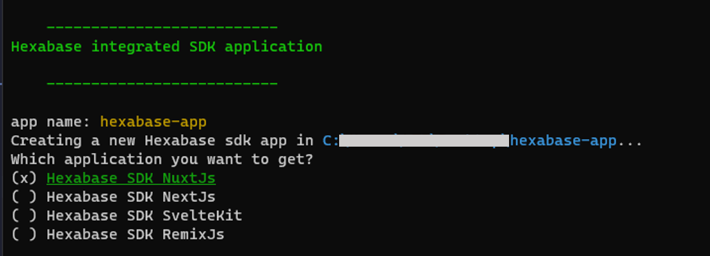
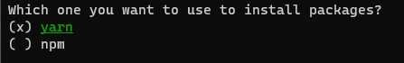

## Hexabase SDK example

To get the application, run:

```ts
npx create-hexabase-app <name>

// When <name> is '.', default result is 'hexabase-app'
```

Then, let's select your application



And select installer package



Once you got the code, to start the project:

- Add your config to .env file (if required)

- Start with chosen installing package command

```ts
npm run dev
```

or

```ts
yarn dev
```
